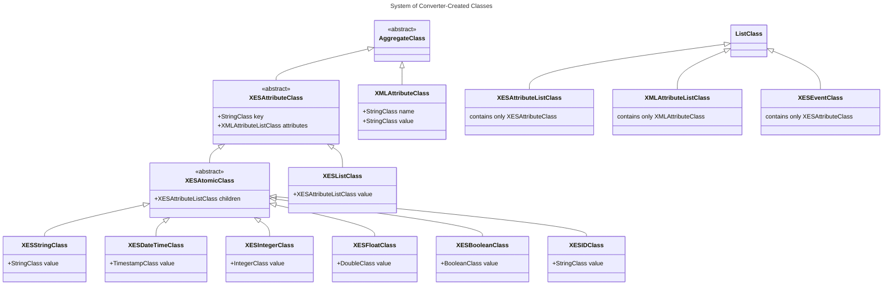

# XEStoNESTConverter - Documentation
### Version: 2.1.0

### Content
1. [Description](#description)
2. [Clarification](#clarification)
3. [Features](#features)
4. [Usage](#usage)
5. [System of Created Classes](#system-of-created-classes)
6. [Validation](#validation)


### Description
This project contains code for converting an XES log
to a list of `NESTSequentialWorkflowObject`s.
NESTSequentialWorkflowObject is a type of data object in the
__ProCAKE framework__ developed at Trier University.
For information on the ProCAKE framework
[see here](https://procake.pages.gitlab.rlp.net/procake-wiki/).
For information on the XES standard
[see here](https://xes-standard.org).

### Clarification
#### XML- vs. XES-attributes
In standard XML jargon, an attribute is something that is
declared inside an opening tag:
```xml
<string key="name" value="John"/>
```
In the above example, 'key' and 'value' are both attributes of
the self-closing 'string'-tag. In XES jargon however, an
attribute is an element of type string, float, boolean, etc.:
```xml
<event>
    <string key="name" value="John"/>
</event>
```
In the above example, the 'string'-element is a so-called
event-attribute. To differentiate between these two meanings,
attributes in the pure XML context will be called 'XML-attribute'
and attributes in the XES context will be called 'XES-attribute'.
So in the last example, the 'string'-element is an XES-attribute,
whereas the opening (and self-closing) 'string'-tag of said element
has two XML-attributes 'key' and 'value'. The XML-attribute-value
of 'key' is 'name' and the XML-attribute-value of 'value' is
'Peter'.

#### Java Classes vs. ProCAKE Data Classes
The ProCAKE framework implements an own class system, apart
from Javas class system. For example, there are pre-defined
'system classes' like 'StringClass' or 'AggregateClass'.
An object of StringClass is a StringObject and an object
of AggregateClass is an AggregateObject etc. In the ProCAKE
context, AggregateClass is a 'data class' and AggregateObject
is a 'data object', whereas in the Java context, both are
classes. AggregateObject is a Java class and an object of
that class represents a 'data object'. AggregateClass is
also a Java class and an object of that class represents a
'data class'. In this README, whenever there are classes
mentioned, __ProCAKE data classes are meant!__ So an 'object
of AggregateClass' is an object of Java class AggregateObject,
or a subclass of that. Such an object has a method
`getDataClass()`, which returns an object of Java class
'DataClass', which in turn represents a ProCAKE data class.

### Features
#### Creation of Subclasses
The converter can be configured to create a new ProCAKE data
class for each key-datatype-pair, where key stands for the
'key' XML-attribute of an XES-attribute and datatype is
the ProCAKE data class provided for the respective type of
that XES-attribute (string, float, boolean, etc.). For more
information on the class system created by the converter
read section
['System of Created Classes'](#system-of-created-classes).

#### Inclusion of XML-attributes
For an XES to be valid ([see 'Validation'](#validation)) every
XES-attribute has to contain the XML-attribute 'key' and every
XES-attribute that is not a list has to contain the
XML-attribute 'value'. Besides these two, any other
XML-attributes are allowed to occur in an XES-attribute.
The converter can be configured to ignore or include these
XML-attributes when creating a representation of an
XES-attribute.

#### Completion of Traces
Events can occur outside of traces in XES but that does not
necessarily mean that they do not belong to any trace.
The converter can be configured such that a non-trace-event
can be appended to a trace according to a certain classifier.
A classifier represents a set of values for the XML-attribute
'key'. For an event or trace which contains XES-attributes
with the given keys, the respective values concatenated are
the identity of the event or trace according to the classifier.
In the example below, two classifiers are defined along with
two traces and one non-trace-event. We'll ignore the
'globals'-elements for a minute...
```xml
<log>
    <globals scope="trace">
        <string key="name" value="unknown"/>
        <string key="surname" value="unknown"/>
    </globals>
    <globals scope="event">
        <string key="name" value="unknown"/>
        <string key="surname" value="unknown"/>
    </globals>
    
    <classifier name="Whole Name" scope="trace" keys="name surname"/>
    <classifier name="Whole Name" scope="event" keys="name surname"/>

    <trace>
        <string key="name" value="John"/>
        <string key="surname" value="Doe"/>
        ...
    </trace>
    
    <trace>
        <string key="name" value="Jane"/>
        <string key="surname" value="Doe"/>
        ...
    </trace>


    <event>
        <string key="name" value="John"/>
        <string key="surname" value="Doe"/>
        ...
    </event>
</log>
```
The classifiers are given
a name, 'Whole Name', a scope, "trace" and "event" respectively,
and a set of keys in the form of a string where different keys
are separated by whitespace (xs:token). The keys are 'name' and
'surname', which means that every event or trace is given an
identity according to the XES-attributes with 'name' and 'surname'
as key. Thus, the first trace is given the identity 'JohnDoe',
the second trace is given the identity 'JaneDoe' and the
non-trace-event is given the identity 'JohnDoe', according to
the 'Whole Name' classifier. Since The first trace and the
non-trace-event share the same identity, the non-trace-event
is to be appended to said trace. That means that conversion
of the following log should lead to the same result as
conversion of the one above (if the feature of trace completion
is enabled!):
```xml
<log>
    <globals scope="trace">
        <string key="name" value="unknown"/>
        <string key="surname" value="unknown"/>
    </globals>
    <globals scope="event">
        <string key="name" value="unknown"/>
        <string key="surname" value="unknown"/>
    </globals>
    
    <classifier name="Whole Name" scope="trace" keys="name surname"/>
    <classifier name="Whole Name" scope="event" keys="name surname"/>

    <trace>
        <string key="name" value="John"/>
        <string key="surname" value="Doe"/>
        ...
        <event>
            <string key="name" value="John"/>
            <string key="surname" value="Doe"/>
            ...
        </event>
    </trace>
    
    <trace>
        <string key="name" value="Jane"/>
        <string key="surname" value="Doe"/>
        ...
    </trace>
</log>
```
Additionally, if there are non-trace-events whose identity
is not assumed by any of the traces present in the log,
a new trace with said identity is to be created, containing
all non-trace-events with that identity. So the following
log
```xml
<log>
    <globals scope="trace">
        <string key="name" value="unknown"/>
        <string key="surname" value="unknown"/>
    </globals>
    <globals scope="event">
        <string key="name" value="unknown"/>
        <string key="surname" value="unknown"/>
    </globals>

    <classifier name="Whole Name" scope="trace" keys="name surname"/>
    <classifier name="Whole Name" scope="event" keys="name surname"/>

    <trace>
        <string key="name" value="John"/>
        <string key="surname" value="Doe"/>
        ...
    </trace>
    
    <trace>
        <string key="name" value="Jane"/>
        <string key="surname" value="Doe"/>
        ...
    </trace>


    <event>
        <string key="name" value="Peter"/>
        <string key="surname" value="Doe"/>
        ...
    </event>
</log>
```
should yield the same result as this one:
```xml
<log>
    <globals scope="trace">
        <string key="name" value="unknown"/>
        <string key="surname" value="unknown"/>
    </globals>
    <globals scope="event">
        <string key="name" value="unknown"/>
        <string key="surname" value="unknown"/>
    </globals>

    <classifier name="Whole Name" scope="trace" keys="name surname"/>
    <classifier name="Whole Name" scope="event" keys="name surname"/>

    <trace>
        <string key="name" value="John"/>
        <string key="surname" value="Doe"/>
        ...
    </trace>
    
    <trace>
        <string key="name" value="Jane"/>
        <string key="surname" value="Doe"/>
        ...
    </trace>
    
    <trace>
        <string key="name" value="Peter"/>
        <string key="surname" value="Doe"/>
        ...
        <event>
            <string key="name" value="Peter"/>
            <string key="surname" value="Doe"/>
            ...
        </event>
    </trace>
</log>
```
Now to ensure that such a created trace (or any trace for that
matter) contains a certain set of XES-attributes, said set
has to be defined in the 'globals' elements. Any XES-attribute
defined in the 'globals' element, which is not part of the key
set given by the classifier is also added to the trace, but
with the default XML-attribute-value for 'value', that is
defined in the 'globals'-element. So the following log
```xml
<log>
    <globals scope="trace">
        <string key="name" value="unknown"/>
        <string key="surname" value="unknown"/>
        <int key="age" value="42"/>
    </globals>
    <globals scope="event">
        <string key="name" value="unknown"/>
        <string key="surname" value="unknown"/>
        <int key="age" value="42"/>
    </globals>

    <classifier name="Whole Name" scope="trace" keys="name surname"/>
    <classifier name="Whole Name" scope="event" keys="name surname"/>

    <trace>
        <string key="name" value="John"/>
        <string key="surname" value="Doe"/>
        ...
    </trace>
    
    <trace>
        <string key="name" value="Jane"/>
        <string key="surname" value="Doe"/>
        ...
    </trace>


    <event>
        <string key="name" value="Peter"/>
        <string key="surname" value="Doe"/>
        ...
    </event>
</log>
```
should yield the same result as this one:
```xml
<log>
    <globals scope="trace">
        <string key="name" value="unknown"/>
        <string key="surname" value="unknown"/>
        <int key="age" value="42"/>
    </globals>
    <globals scope="event">
        <string key="name" value="unknown"/>
        <string key="surname" value="unknown"/>
    </globals>

    <classifier name="Whole Name" scope="trace" keys="name surname"/>
    <classifier name="Whole Name" scope="event" keys="name surname"/>

    <trace>
        <string key="name" value="John"/>
        <string key="surname" value="Doe"/>
        ...
    </trace>
    
    <trace>
        <string key="name" value="Jane"/>
        <string key="surname" value="Doe"/>
        ...
    </trace>
    
    <trace>
        <string key="name" value="Peter"/>
        <string key="surname" value="Doe"/>
        <int key="age" value="42"/>
        ...
        <event>
            <string key="name" value="Peter"/>
            <string key="surname" value="Doe"/>
            ...
        </event>
    </trace>
</log>
```
Note, that, even though the 'age' XES-attribute was also defined
as a global XES-attribute for events, it was not added to the
non-trace-event. It is only important, that each trace and event
does indeed contain the classifying XES-attributes, i.e. the ones
with the keys defined in the classifier. Finally, since more than
one classifier can be defined for each scope, a classifier name
is to be provided when this feature is to be used (see section
['Usage'](#usage)). When such a classifier does not exist in
the log, the converter deactivates the feature.

### Usage
To convert a `String` containing an XES log, first an
implementation of the abstract class `XEStoNESTConverter`
has to be initialized using a `DataModel`:

```java
Model model = ModelFactory.getDefaultModel();
XEStoNESTConverter converter = new XEStoNESTsAXConverter(model);
```

The converter used in this example is the __SAX parser__
based converter `XEStoNESTsAXConverter`, which currently
is the only implementation of `XEStoNESTConverter`.

After initializing the converter, one of the methods
`configure(boolean createSubclasses, boolean includeXMLattributes)` or
`configure(boolean createSubclasses, boolean includeXMLattributes, String classifierName)`
can be called to configure the converter. Calling the first one
is the same as calling the second one with `null` in the third
argument. The first argument de-/activates the feature
['Creation of Subclasses'](#creation-of-subclasses), the
second argument de-/activates the feature
['Inclusion of XML-attributes'](#inclusion-of-xml-attributes),
and passing a valid classifier name as the second argument
enables the ['Completion of Traces'](#completion-of-traces)
feature. Valid means, that there are trace- and event-classifiers
present in the log with the given name.


After initialization and configuration, the
`convert(String xes)` method can be called, returning
an `ArrayList` of `NESTSequentialWorkflowObject`s. The
argument xes should be a `String` containing a
[valid XES log](#validation).

Below you can see a full example:

```java
Model model = ModelFactory.getDefaultModel();
XEStoNESTConverter converter = new XEStoNESTsAXConverter(model);
converter.configure(true, "Whole Name");
String xes = Files.readString("path/to/file.xes", StandardCharset.UTF_8);
ArrayList<NESTSequentialWorkflowObject> workflows = converter.convert(xes);
```

### System of Created Classes
There are 7 types of XES-attributes which relate to ProCAKE
data classes in the following way:

| XES-attribute type | ProCAKE data class | Converter-Created data class |
|--------------------|--------------------|------------------------------|
| string             | StringClass        | XESStringClass               |
| date               | TimestampClass     | XESDateTimeClass             |
| int                | IntegerClass       | XESIntegerClass              |
| float              | DoubleClass        | XESFloatClass                |
| boolean            | BooleanClass       | XESBooleanClass              |
| id                 | StringClass        | XESIDClass                   |
| list               | ListClass          | XESListClass                 |

In the table above you can also see the respective ProCAKE data
classes that are created by the converter. However, these
are not the only classes created. Below you can see the full
inheritance tree of ProCAKE data classes created by the converter:



In the following table, the purpose of each data class
involved in the class diagram above is explained.

| Data Class            | Purpose                                                                                                                                                                                                                                                                                                                                                                                                                                                                                                                                                                                                                                                                                                                                             |
|-----------------------|-----------------------------------------------------------------------------------------------------------------------------------------------------------------------------------------------------------------------------------------------------------------------------------------------------------------------------------------------------------------------------------------------------------------------------------------------------------------------------------------------------------------------------------------------------------------------------------------------------------------------------------------------------------------------------------------------------------------------------------------------------|
| AggregateClass        | This abstract ProCAKE system class serves as ancestor for the classes representing an XES-attribute or an XML-attribute of an XES-attribute. An AggregateObject is an object with arbitrarily many 'aggregate-attributes'. The names and types of attributes (and thus the total amount of attributes) are defined by the respective subclass of AgrregateClass. For example, an AggregateObject of data class 'XESFloatClass' is an AggregateObject with the following aggregate-attributes: 'key' of StringClass, 'attributes' of XMLAttributeListClass, 'children' of XESAttributeListClass and 'value' of DoubleClass. For more information on AggregateObjects, [see here](https://procake.pages.gitlab.rlp.net/procake-wiki/data/aggregate/). |
| ListClass             | This ProCAKE system class serves as ancestor for list based classes, i.e. classes whose elements have to be of a certain (sub-)class.                                                                                                                                                                                                                                                                                                                                                                                                                                                                                                                                                                                                               |
| StringClass           | The ProCAKE system class for string representation.                                                                                                                                                                                                                                                                                                                                                                                                                                                                                                                                                                                                                                                                                                 |
| TimestampClass        | The ProCAKE system class for timestamp representation.                                                                                                                                                                                                                                                                                                                                                                                                                                                                                                                                                                                                                                                                                              |
| IntegerClass          | The ProCAKE system class for whole number representation.                                                                                                                                                                                                                                                                                                                                                                                                                                                                                                                                                                                                                                                                                           |
| DoubleClass           | The ProCAKE system class for floating point number representation.                                                                                                                                                                                                                                                                                                                                                                                                                                                                                                                                                                                                                                                                                  |
| BooleanClass          | The ProCAKE system class for boolean value representation.                                                                                                                                                                                                                                                                                                                                                                                                                                                                                                                                                                                                                                                                                          |
| XMLAttributeClass     | This class represents an XML-attribute. An XML-attribute has a name and a value.                                                                                                                                                                                                                                                                                                                                                                                                                                                                                                                                                                                                                                                                    |
| XMLAttributeListClass | This class represents a list of XML-attributes. Aside from the 'key' XML-attribute every XES-attribute has and the 'value' XML-attribute every XES-attribute but the 'list' XES-attribute has, there can be other XML-attributes. These attributes are stored in an XMLAttributeList-object.                                                                                                                                                                                                                                                                                                                                                                                                                                                        |
| XESAttributeClass     | This abstract class represents an XES-attribute and thus contains a 'key'. Additionally it contains a possibly empty XMLAttributeList-object.                                                                                                                                                                                                                                                                                                                                                                                                                                                                                                                                                                                                       |
| XESAttributeListClass | This class represents a list of objects with classes inheriting from the XESAttributeClass.                                                                                                                                                                                                                                                                                                                                                                                                                                                                                                                                                                                                                                                         |
| XESAtomicClass        | This abstract class represents XES-attributes that are not 'list' XES-attributes. Since their respective values are not derived from their child elements (in contrast to the 'list' XES-attribute), these child elements are stored in the 'children' field, which is a possibly empty list of objects of XESAttributeClass.                                                                                                                                                                                                                                                                                                                                                                                                                       |
| XESStringClass        | This class represents 'string' XES-attributes. The value is a StringObject.                                                                                                                                                                                                                                                                                                                                                                                                                                                                                                                                                                                                                                                                         |
| XESDateTimeClass      | This class represents 'date' XES-attributes. The value is a TimestampObject.                                                                                                                                                                                                                                                                                                                                                                                                                                                                                                                                                                                                                                                                        |
| XESIntegerClass       | This class represents 'int' XES-attributes. The value is an IntegerObject.                                                                                                                                                                                                                                                                                                                                                                                                                                                                                                                                                                                                                                                                          |
| XESFloatClass         | This class represents 'float' XES-attributes. The value is a DoubleObject.                                                                                                                                                                                                                                                                                                                                                                                                                                                                                                                                                                                                                                                                          |
| XESIDClass            | This class represents 'id' XES-attributes. The value is a StringObject.                                                                                                                                                                                                                                                                                                                                                                                                                                                                                                                                                                                                                                                                             |
| XESListClass          | This class represents 'list' XES-attributes. The value is an object of XESAttributeClass.                                                                                                                                                                                                                                                                                                                                                                                                                                                                                                                                                                                                                                                           |
| XESEventClass         | This class represents 'event' XES-attributes. An event is seen as a list (or set, it doesn't matter) of XES-attributes. After conversion, an object representing an event will be the semantic descriptor of a TaskNode inside a NESTSequentialWorkflowObject, which in turn represents a trace.                                                                                                                                                                                                                                                                                                                                                                                                                                                    |

### Validation

The file containing the schema the XES should be
valid against can be found at `main/resources/OCv1.xsd`.